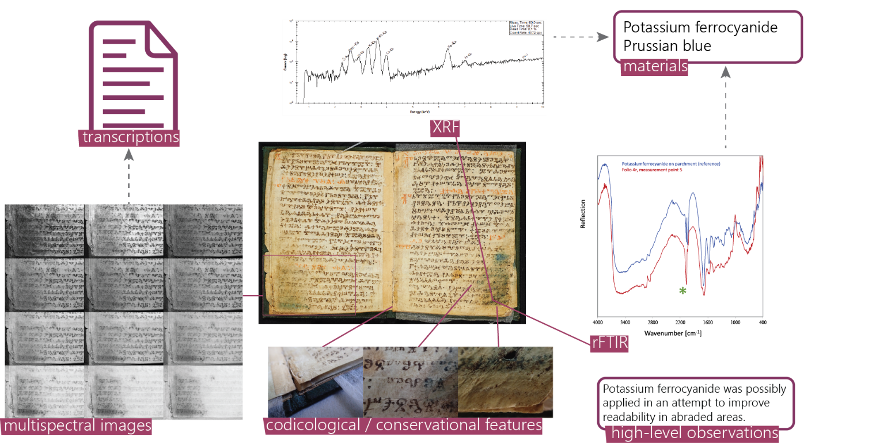
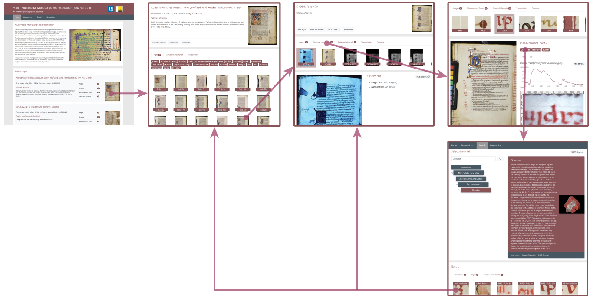
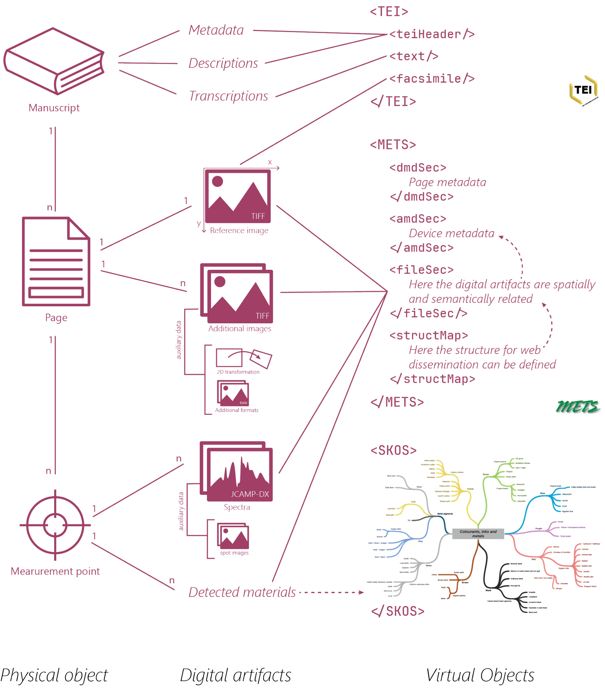

Research on historical manuscripts is increasingly supported by technical disciplines: Multi- and Hyperspectral Imaging support the recovery of degraded or deliberately removed contents; spectroscopic analysis methods are used for the identification and characterization of inks, pigments and substrates, which in turn provides evidence for reconstructing the origin and history of a manuscript.

Each line of investigation produces specific digital artifacts such as imagery, spectroscopic measurements, or high-level analysis results. If the various investigations are carried out by different institutions and at different times, the artifacts produced mostly exist independently from each other and lack a common frame of reference. Thus, the potential for re-use in interdisciplinary research is limited and their effective life cycle often ends with the research projects in which they are acquired.

_Figure 1: Example for a double-page of a medieval codex with related measurement data and research results (placeholder for interactive figure 1)_

Multi-Modal Manuscript Representations (M3R) is a repository for the archiving and dissemination of manuscript research data, in which the various digital artifacts are spatially and logically related. With respect to long-term preservation and linked open data, special emphasis is put on the use of established and open standards for data and metadata. The resulting virtual objects are disseminated via technical interfaces but also via an interactive web viewer. Thus, the data available in the repository is made long-term accessible not only for natural sciences and technology, but also for research and education in the humanities.

##Everything is connected
Figure 2 attempts to visualize the conceptual ideas behind M3R. At the top level, we start from the Manuscript, a physical object that is stored and inventorized in an archive or library - it can be in the form of a codex (a “book”), a collection of fragments, or even a scroll. Information that concerns the whole Manuscript of larger portions of it – e.g., provenience information, conservatory condition, script characteristics or transcriptions – are stored in the well-established TEI format.
The Manuscript is divided into Pages, which are the surfaces that are inscribed with text. For codices and fragments, the Pages will mostly correspond to the sides of leaves; for scrolls or other objects, the definition is more liberal. In any case, the area of a Page is technically defined by a Reference image – usually a natural color image showing the respective surface. Any additional imagery of the page, e.g., multispectral images or elemental distribution maps are equipped with a 2D-transformation that defines its correct alignment to the Reference image.
Within a Page, several Measurement points can be defined: they hold punctual information about the manuscript surface, such as spectroscopic measurements performed at that spot or the materials identified. The locations of Measurement points are given in terms of pixel coordinates within the Reference image of the respective Page.
Just as the high-level information about the Manuscript is stored in the TEI format, information about individual pages, measurement points and digital artifacts should be modeled using established and/or open standards. For example, images are stored as TIFF, spectroscopic measurements as JCAMP-DX, and the materials identified at measurement points (e.g., chemical elements, ink types, pigments) are given via concepts of a taxonomy in SKOS format. 
The “glue” for connecting all the pieces of information belonging to a given page is provided by the METS standard. 
It allows the modelling of the semantic and spatial relations between the individual digital artifacts, as well as the storage of metadata about the measurement devices employed.

_Figure 2: Logical structure of Multi-Modal Manuscript Representations (M3R)_

##Easy access
A prototype repository following the concepts outlines above is implemented on the GAMS infrastructure of Uni Graz, including an intuitive graphical user interface in the form of a web site.
On the website, the user can start exploration from two sides: from an object-centered perspective, the user is interested in a certain manuscript and finds the various digital representations and measurements associated with it; from a materials-centered perspective, the user is interested in the occurrence of certain inks, pigments or other substances and finds the manuscripts and measurement points, where they were detected. Figure 3 gives a first glimpse of the possibilities; however, hands-on experience is worth a thousand pictures, and the interested reader can try out the actual prototype: 
http://gams-staging.uni-graz.at/context:mmmr 

_Figure 3:  A graphical user interface for navigation in the repository is provided via a website._

Additional to this user-friendly mode of access, technical interfaces are provided for automated data harvesting or integration in third-party applications: 
IIIF image and presentation API
SPARQL endspoint
Direct access to original datastreams
Comprehensive metadata in standardized formats for all digital objects
Harvestable OAI-PMH endpoint
